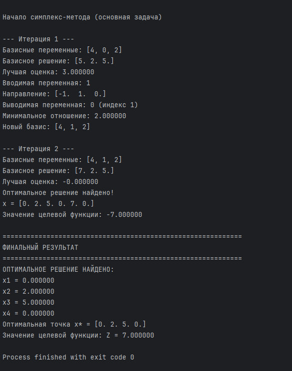

# Методы оптимизации
## Выполнил: Джаватов Ильяс 1.2
# Краткое описание алгоритма решения ЗЛП:
## Основные этапы алгоритма:
## 1. Приведение к канонической форме
1. Преобразование минимизации в максимизацию: min Z → max (-Z)

2. Добавление slack-переменных: для ограничений ≤

3. Добавление surplus-переменных: для ограничений ≥

4. Обработка границ переменных: замена xᵢ = xᵢ⁺ - xᵢ⁻ для переменных, которые могут быть отрицательными

## 2. Формирование вспомогательной задачи
1. Добавление искусственных переменных для ограничений типа = и ≥

2. Целевая функция: минимизация суммы искусственных переменных

3. Цель: найти начальное допустимое базисное решение

## 3. Решение вспомогательной задачи
1. Начальный базис: искусственные переменные

2. Симплекс-метод: поиск оптимального решения

3. Проверка совместности: если значение > 0 → задача несовместна

## 4. Решение основной задачи
1. Удаление искусственных переменных

2. Использование найденного базиса

3. Симплекс-метод: поиск оптимального решения исходной задачи

--------------------------------------------------------------

# Демонстрация работы программы:
Вариант задания 10.

После запуска программы получаем:

Параметры поиска решения в Excel:

Результат поиска решения в Excel:

